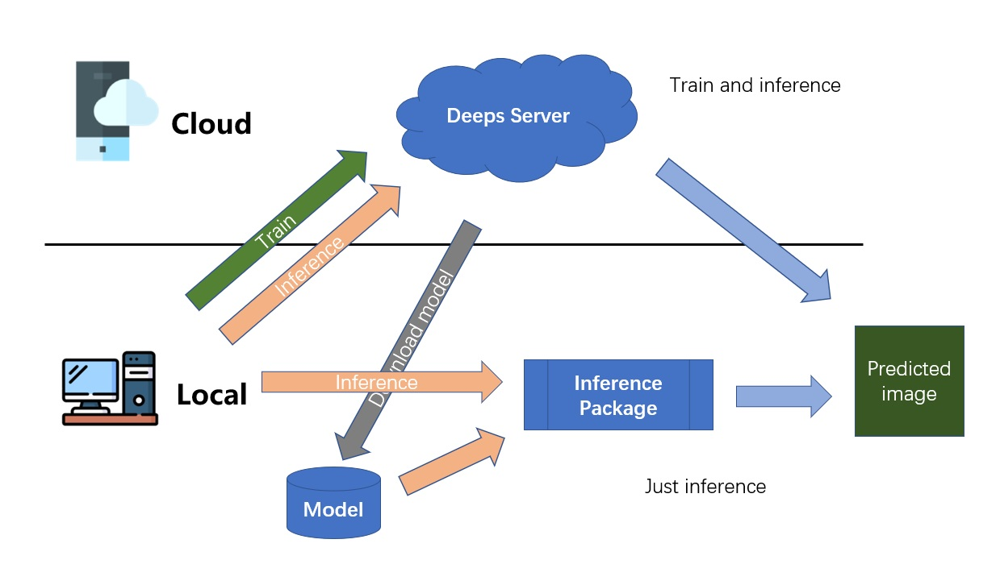

# Deeps Server Inference Package
A released inference package of [deeps server](http://deeps.cibr.ac.cn/), which easily processes your data in local computer.


## Instruction

### Download Files
Three files are available, you can download files from [here](http://119.90.33.35:3557/sharing/wJWmfODpQ):
    
- **Executable file**: main.exe;
- **Config file**: config.yaml;
- **Pre-trained model file**: model/.

### Config
Modify the config file: ```config.yaml```.

- **img_path**: The path of an image(ONLY ONE), or the folder path of lots of images;
- **model_path**: Model path. One model has two files, for example:

        model_68900.data-00000-of-00001
        model_68900.index
        
    So parameters ```model_path``` should be set to ```{current directory}\model_68900```
- **sr_or_os**: Option:sr,os. If your task is "image super-resolution", you should select ```sr```,
conversely, you should select ```os```. But it's important to note that parameters: ```sr_or_os``` and ```model_path``` should be corresponding.

### Run
Double-click ```main.exe``` to run, a cmd window will pop up, and then the output text will print during the executive process.

**Useful Links** 

💜 Deeps homepage: http://deeps.cibr.ac.cn/

💜 Deeps inference package repository: https://github.com/azzhu/Deeps_Inference_Package

💜 Deeps server repository: https://github.com/azzhu/deeps

💜 CIBR homepage: http://www.cibr.ac.cn/